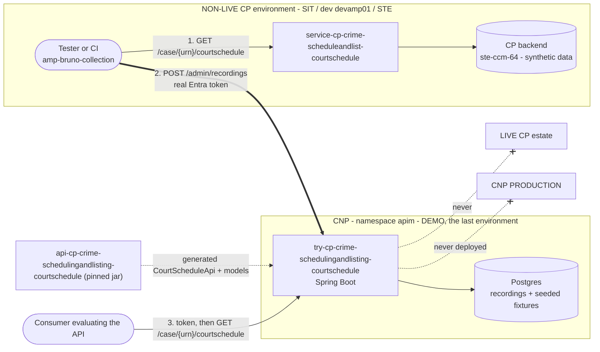
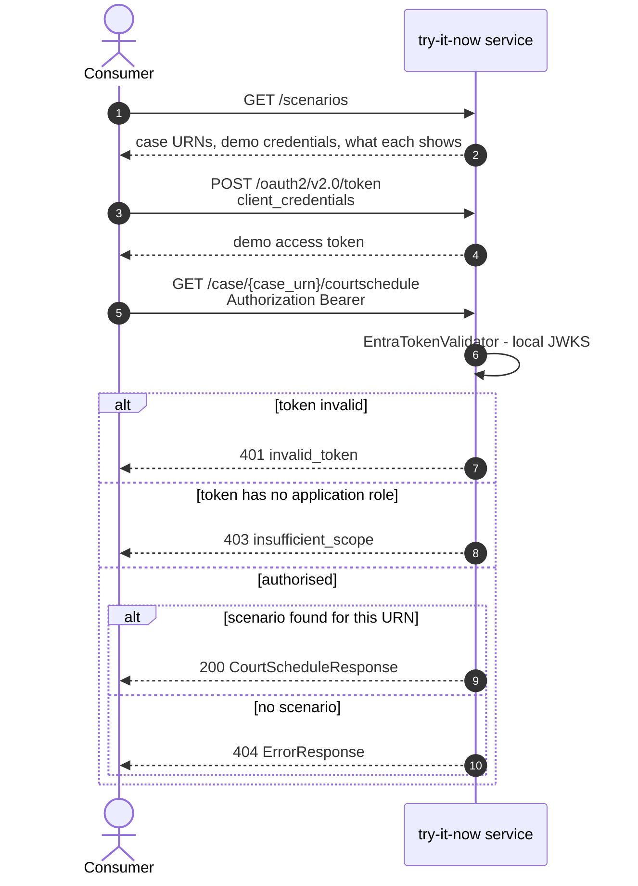
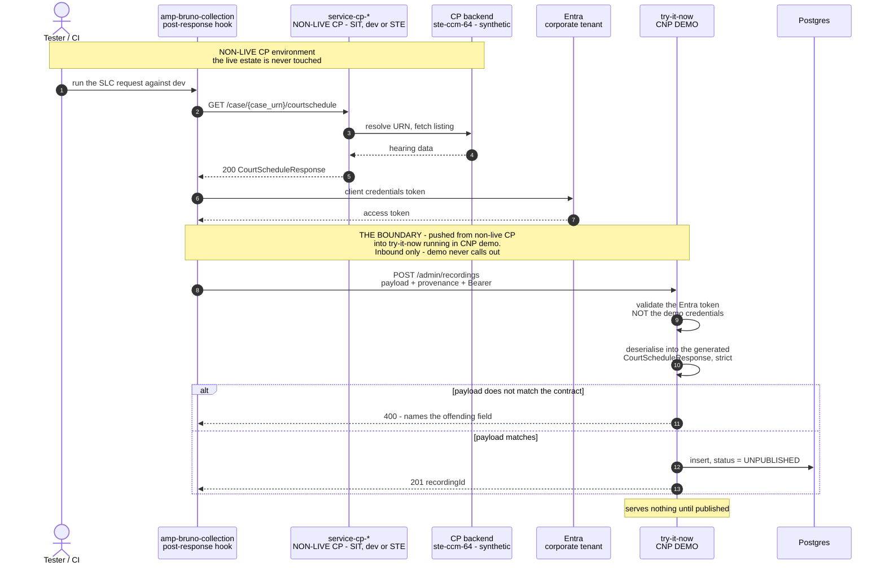
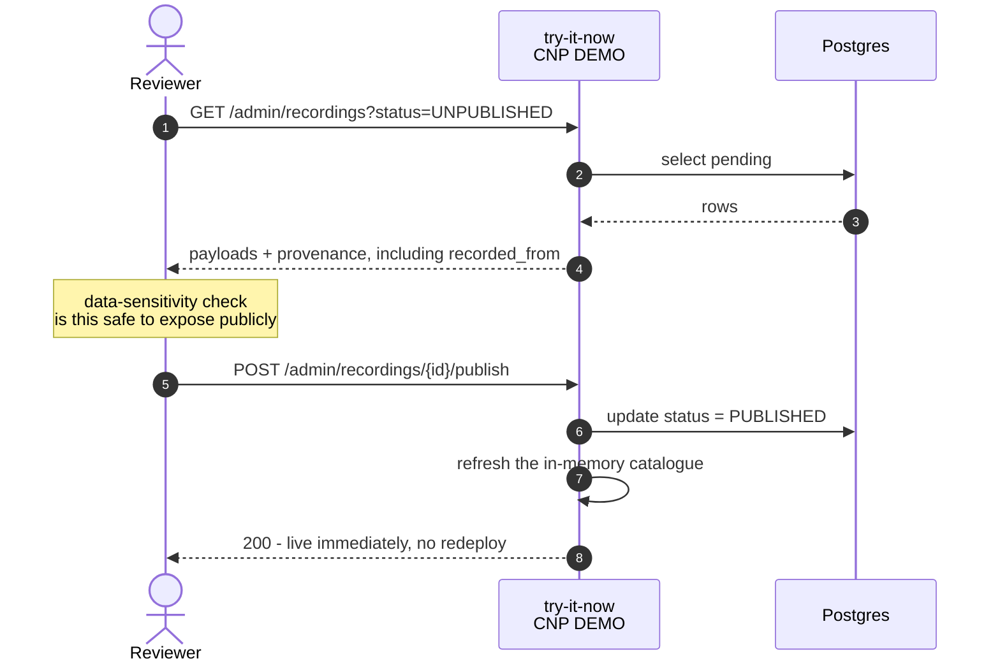

# try-cp-crime-schedulingandlisting-courtschedule

A sandbox implementation of the **Scheduling and Listing Court Schedule API**, so a prospective
consumer can call the API and see real response shapes *before* requesting access to the live one.

It implements the generated interface from
[`api-cp-crime-schedulingandlisting-courtschedule`](https://github.com/hmcts/api-cp-crime-schedulingandlisting-courtschedule).
It holds no Common Platform data, has no route to a CP backend, and is not intended to acquire one.

| | |
|---|---|
| Product / component | `apim` / `try-slc` |
| Platform | CNP (Jenkins + Flux), namespace `apim` |
| Contract | `uk.gov.hmcts.cp:api-cp-crime-schedulingandlisting-courtschedule:1.1.0` |
| Backend dependencies | **none** |
| Design | [Try it now service](https://hmcts.atlassian.net/wiki/spaces/AMP/pages/327713375/Try+it+now+service) on Confluence — the source of truth for the design |

> **State.** The recording pipeline is **implemented**. Examples live in Postgres; the committed
> fixtures in `src/main/resources/stubs/` are seeded at first boot as the floor, and recordings
> captured from a **non-live CP environment** supersede them once published. What is *not* done is
> the infrastructure: the Postgres module and the admin Entra app registration — see
> [CNP-ONBOARDING-PLAN.md](CNP-ONBOARDING-PLAN.md).

> **Where this runs, and where the data comes from.** **Demo is the last environment.** This service
> is deliberately never deployed to production — the environments are sandbox, preview, AAT and then
> demo, and demo is the end of the line.
>
> Every example served here is captured from a **non-production CP environment** — the
> `service-cp-*` deployment in SIT, dev (`devamp01`) or STE, in front of the CP backend — and
> **pushed into the demo try-it-now running in CNP** over its admin API. The live CP estate is never
> read, at capture time or at serve time. The direction matters: the capture is run from the
> non-live CP environment and pushes *in*; this service never reaches *out*.

---

## Architecture



**Read the arrows by direction.** The thick arrow is the only thing that crosses into CNP, and it is
*inbound*: the capture runs in the non-live CP environment and pushes the response into demo over
the admin API. This service makes no outbound call to anything — it validates tokens against a key
it holds in memory and answers from its own store. That is what lets it live in CNP with no CP
connectivity and no route to the live estate, at capture time or at serve time.

**It is not a network path.** There is no CP-to-CNP peering, and `cnp-cp-integration` is an empty
repo. What crosses is an authenticated HTTPS client running in the CP environment calling a public
demo host. The admin realm's Entra token is the whole of the control; the network provides none.

A consequence worth stating plainly: **the demo sandbox holds data captured from a non-live CP
environment, and nothing else.** If a case URN appears here, it came from SIT, dev or STE.

---

## Serving a consumer

`GET /scenarios` is unauthenticated and self-documenting — it lists the credentials, the case URNs
and what each one demonstrates.



```bash
BASE=https://apim-try-slc-staging.aat.platform.hmcts.net

# 1. Get a token (same client_credentials form post as Entra)
TOKEN=$(curl -s -X POST $BASE/oauth2/v2.0/token \
  -H 'Content-Type: application/x-www-form-urlencoded' \
  -d 'grant_type=client_credentials&client_id=11111111-1111-4111-8111-111111111111&client_secret=try-it-now-demo-secret' \
  | jq -r .access_token)

# 2. Call the API
curl -s -H "Authorization: Bearer $TOKEN" $BASE/case/TIN-ALLOCATED-01/courtschedule
```

### Scenarios

| Case URN | Status | Demonstrates |
|---|---|---|
| `TIN-ALLOCATED-01` | 200 | Allocated hearing with a court sitting |
| `TIN-WEEKCOMM-01` | 200 | Unallocated — empty `courtSittings` with a `weekCommencing` block |
| `TIN-MULTI-01` | 200 | Two hearings on one case, one of each kind |
| `TIN-EMPTY-01` | 200 | Case with no hearings — an empty array, still a 200 |
| `TIN-NOTFOUND-01` | 404 | No schedule for the URN (as does any unrecognised URN) |
| `TIN-BADREQUEST-01` | 400 | Malformed case URN |
| `TIN-SERVERERROR-01` | 500 | Backend failure, for exercising retry handling |

The 200s with an empty `courtSittings` or an empty `courtSchedule` are **valid responses, not
faults** — same as the live API (AMS handover pack §6.4).

### Demo credentials

Both published deliberately; they authorise nothing beyond this sandbox.

| Client | `client_id` | Outcome |
|---|---|---|
| Reader | `11111111-1111-4111-8111-111111111111` | Carries `app.read` — calls succeed |
| Unentitled | `22222222-2222-4222-8222-222222222222` | No role — every call answers **403** |

Secret for both: `try-it-now-demo-secret`. Presenting a wrong secret answers **401**. These are not
canned error bodies: the 401 and 403 come from the same validator that guards the live API.

---

## How the auth works, and why it is not a mock

The auth code is copied from `service-cp-crime-scheduleandlist-courtschedule` and runs in
`AUTH_MODE=ENFORCE`. `EntraTokenValidator`, `EntraAuthProperties`, `AuthMode`, `ValidatedCaller` and
`TokenValidationException` are **byte-identical** to their source — `diff` reports no change.
`AuthorizationPolicy` adds exempt paths, and the two filters diverge as documented in each file.
Tokens are verified for real: RS256 signature, exact `iss`/`tid`/`ver`/`aud`, `exp`/`nbf`,
`sub == oid` app-only assertion, prohibited `scp`, and a non-empty `roles` claim.

The single difference is the key source. `AppConfig` supplies an `ImmutableJWKSet` holding this
service's own demo key instead of a `JWKSourceBuilder` fetching a tenant's JWKS over HTTPS. That is
what lets it run with **no egress at all** — no CP network, no Entra.

Because this sandbox is its own issuer, **a demo token is worthless against any real API**: the
`iss`, `aud` and `tid` are its own.

### Signing key

Supplied as a JWK document from the `apim-{env}` key vault as `DEMO_SIGNING_KEY_JWK`. It must be
stable: Flux redeploys on every merge to master, and a key generated per-process would invalidate
every token already issued — surfacing as intermittent 401s that read as a platform fault. Seed it
once per environment:

```bash
az keyvault secret set --vault-name apim-aat \
  --name try-slc-DEMO-SIGNING-KEY-JWK --file demo-signing-key.jwk.json
```

Left blank, the service generates an ephemeral key and logs a warning — local development only.

---

## Adding or changing a scenario

Two ways in, and they meet at the same contract gate.

**A committed fixture** — the baseline a fresh environment starts with:

1. Add the body to `src/main/resources/stubs/`.
2. Register it in `src/main/resources/stubs/scenarios.yaml`.

**A recording** — captured from a real response, via `POST /admin/recordings`. It arrives
unpublished and serves nothing until someone with the publish role approves it.

Fixtures are seeded only for URNs with nothing published, so a recording that has superseded a
fixture is never reverted by a restart.

Both paths run the same `ContractValidator`, which deserialises the body into the generated model
with unknown-property checking on. A fixture that drifts fails the build (`FixtureLoaderTest`) and
fails startup; a recording that drifts is rejected at ingest with a 400 naming the offending field.
That check is why this service depends on the `api-cp-*` artefact rather than serving JSON from a
file server — and it is what a WireMock or Prism deployment could not give you. When the contract
version in `build.gradle` is bumped, anything that no longer fits turns the build red.

Because of `@JsonInclude(NON_NULL)` on the generated models, never write `"field": null` into a stub
expecting it to appear in the response — it is dropped. Use a real value or omit the field.

---

## Recording pipeline

Examples are **recorded from the real service in a non-live CP environment** and **pushed into the
demo try-it-now running in CNP**, which then serves them. Those are two different estates and two
different environments, and the split is the point: the data is real in *shape* because it came from
the real service, and safe to publish because it came from a non-production environment. Full design
detail is on
[Confluence](https://hmcts.atlassian.net/wiki/spaces/AMP/pages/327713375/Try+it+now+service); the
shape is:

| Concern | Environment | Where |
|---|---|---|
| **Capture** a real response | **Non-live CP** — SIT, dev (`devamp01`) or STE, in front of the CP backend | `amp-bruno-collection`, run from that environment |
| **Push** across the boundary | From non-live CP **into** CNP demo | `POST /admin/recordings`, with a real corporate Entra token |
| **Validate** and store | **CNP demo** | Ingest endpoint on the demo try-it-now |
| **Serve** to consumers | **CNP demo** | Demo try-it-now, from Postgres |

Nothing in this flow reads the **live** CP estate, and nothing in it runs in the live CP estate. The
only crossing is the push, and it is initiated from the non-live CP environment — the demo service
never calls out.

**Demo being the last environment does not make this low-stakes.** Demo exists precisely so it can
be shown to people outside HMCTS: it is reachable without a VPN, behind Front Door. A published
recording there is on the public internet. Everything below about the ingest gate, the two auth
realms and the publish review applies exactly as it would have in production — the only thing that
changed is which environment is the destination.

### Endpoints

| | |
|---|---|
| `POST /admin/recordings` | Ingest. Validates against the contract, stores `UNPUBLISHED`. Needs `app.recordings.write`. |
| `GET /admin/recordings?status=UNPUBLISHED` | What is awaiting review, with provenance and body. Needs `app.recordings.write`. |
| `POST /admin/recordings/{id}/publish` | Makes it live and refreshes the catalogue. Needs `app.recordings.publish`. |
| `POST /admin/recordings/{id}/archive` | Takes it out of service, keeping the record. Needs `app.recordings.publish`. |

Two roles, not one: capture is automated and frequent, publishing is the step that puts data in
front of the public. All four are guarded by `AdminAuthFilter` with a **real corporate Entra token** —
never the published demo credentials, which would otherwise open a write path into a deployed
environment.



Recordings arrive **unpublished** and serve nothing. A separate, separately-authorised call makes
one live — ingest checks the *shape*, publish is where a human checks the *content* is fit to be
public:



Three things this design turns on, all of which matter to anyone implementing it:

- **The ingest gate is the point.** The same contract check that runs at build time today moves to
  ingest time. A recording that does not fit the published contract is rejected with the field named.
- **Ingest authenticates with a real Entra token**, never the demo credentials — those are published
  in the catalogue and must not open a write path into a deployed environment. `/admin/**` should
  also be restricted at the edge, separately from the public read API.
- **Non-live as the source is a safety property, not a convenience.** Captures land in a demo service
  that is one approval away from being publicly readable — demo needs no VPN, by design — so the only
  thing standing between a real case and the public internet is the choice of source environment.
  Recording from live CP would defeat the design however carefully the review step is run. Confirm
  that the source environment holds synthetic data before recording anything; with SIT now named as a
  capture source, the question covers SIT as well as `ste-ccm-64`, and is still unanswered.
- **Provenance is recorded, not assumed.** Every row carries `recorded_from`, and the reviewer sees
  it on the publish screen. If a recording cannot name the non-live environment it came from, that
  is the signal to archive it rather than publish it.

---

## Three contract defects this work surfaced

All three are in `api-cp-crime-schedulingandlisting-courtschedule` and worth fixing there. Under the
recording design they stop being documentation issues and start blocking ingest.

1. **The spec's `examples` do not match its own schema.** `CourtScheduleResponse` is
   `{ courtSchedule: [ { hearings: [...] } ] }`, but both response examples are shaped
   `{ hearings: { ... } }` — no `courtSchedule` wrapper, and `hearings` as an object. A stub built
   from those examples deserialises to an empty response. The fixtures here follow the **schema**.
   The wrong shape is baked into the published jar's `@ExampleObject` annotations too.
2. **The live service returns fields the contract does not define.** The AMS handover pack §5.1
   documents `courtHouse` and `lastUpdatedTime` on each hearing; neither is in the `Hearing` schema.
   The fixtures here omit them, per the handover pack's own rule that the contract page is
   authoritative for payload shape. **The first real recording will be rejected because of this.**
3. **`listNote` can never be returned as null.** The schema says it "will always be required but can
   be null", and the handover pack's healthy-response check for `/slc` reads "`listNote` is always
   present but may be `null`". Both are unachievable: the generator config applies
   `@JsonInclude(NON_NULL)` to every model, so a null `listNote` is omitted from the JSON entirely.
   Verified here by serving a fixture with `"listNote": null` and observing the field absent.
   **This applies to the live service too** — it uses the same generated models.

The guard that would have caught (1) is switched off: `oas3-valid-media-example` and
`oas3-valid-schema-example` are set to `off` in `.spectral.yml` across all six API repos.

The spec also declares no `securitySchemes`, so Swagger UI shows no **Authorize** button. Adding a
`clientCredentials` scheme pointing `tokenUrl` at this sandbox's token endpoint is what would make
"Try it out" usable end to end.

---

## Local development

```bash
# Postgres is required - the store is no longer files
docker run -d --name tin-pg -e POSTGRES_PASSWORD=postgres -e POSTGRES_DB=tryitnow \
  -p 5432:5432 postgres:16-alpine

./gradlew build          # compile, contract-check fixtures, TestContainers integration tests
ADMIN_DISABLED=true ./gradlew bootRun
curl localhost:8080/scenarios
```

`./gradlew build` needs Docker running — the store and the full ingest/publish journey are tested
against a real Postgres via TestContainers, not an in-memory substitute.

`ADMIN_DISABLED=true` is needed locally because the admin realm verifies against a real Entra tenant
and refuses to start without one. It makes `/admin/**` answer 503 rather than leaving it open.

The `api-cp-*` artefact resolves from the HMCTS Azure Artifacts feed. To build against an unreleased
spec, publish it locally first:

```bash
cd ../api-cp-crime-schedulingandlisting-courtschedule
./gradlew publishToMavenLocal -DAPI_SPEC_VERSION=1.1.0
```

Two defects found by running the service, both fixed and covered by regression tests — worth knowing
about because both are easy to reintroduce:

- **CORS preflight returned 401.** `OPTIONS` carries no `Authorization` header, so the auth filter
  rejected it and the browser abandoned the exchange before sending the real request. Try-it-out
  fails while curl succeeds.
- **`/health` would have CrashLoopBackOff'd the pod.** With `management.endpoints.web.base-path: /`,
  the inherited prefix rule cannot match `/health`, so the liveness probe would have been answered
  401.

---

## Deployment

CNP, via Jenkins (`Jenkinsfile_CNP` → `withPipeline('java', 'apim', 'try-slc')`) and Flux.
Remaining onboarding steps are tracked in [CNP-ONBOARDING-PLAN.md](CNP-ONBOARDING-PLAN.md).

**Demo is the last environment.** Sandbox, preview, AAT, then demo. There is no production
deployment of this service and there is not meant to be one.

| Environment | Host | Role |
|---|---|---|
| sandbox, AAT | `apim-try-slc-{env}.service.core-compute-{env}.internal` | Internal. Build and rehearse |
| preview | `apim-try-slc-pr-{N}.preview.platform.hmcts.net` | Per-PR, Jenkins-deployed, destroyed nightly |
| **demo** | `apim-try-slc.demo.platform.hmcts.net`, behind Front Door | **The live one.** Public, no VPN |
| production | — | **Deliberately none** |

Two things depend on demo being the terminal environment, and both are the reason it is public:

- **Consumers reach it from the public API catalogue.** Try-it-out is a browser call from
  `https://hmcts.github.io`, which is why CORS is configured through `demo.allowed-origins`.
- **The production Marketplace issues try-it-now credentials against a demo-tier APIM.** The
  production `service-api-marketplace` calls the demo APIM to generate the API keys a developer uses
  here. That is a production service with a dependency on a demo environment — see the note in
  [CNP-ONBOARDING-PLAN.md](CNP-ONBOARDING-PLAN.md), because it is a real operational consequence
  rather than a detail.

Being public is also why `/admin/**` must be restricted at the edge, separately from the read API.
The ingest endpoint writes data that is one approval away from being internet-readable.
